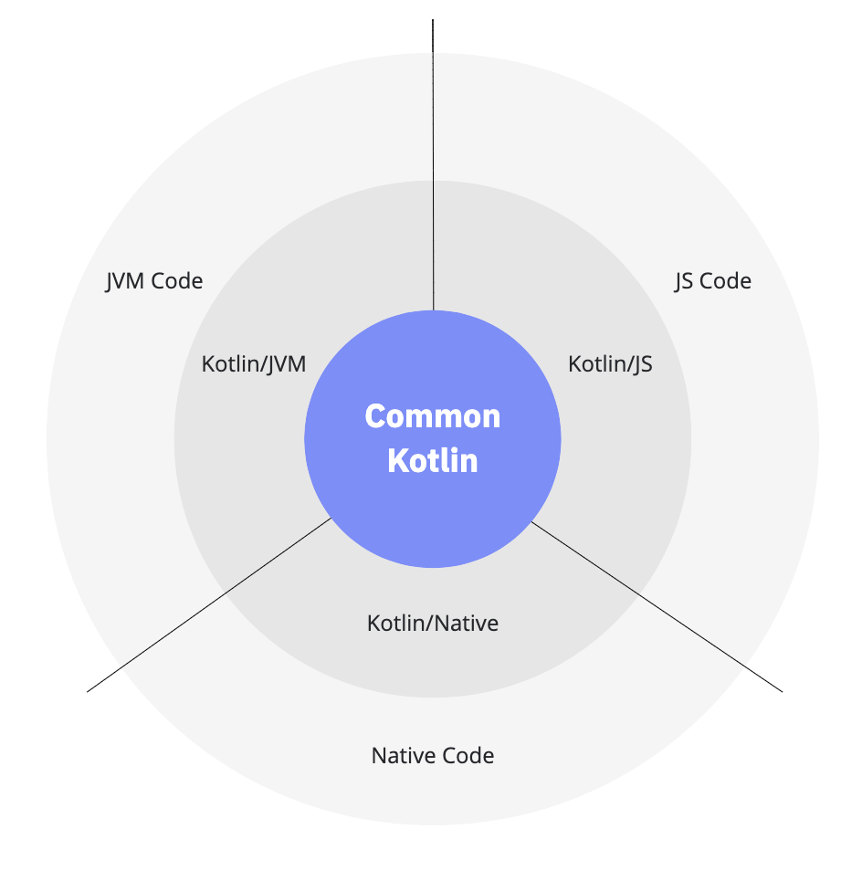

## Kotlin 멀티플랫폼

Kotlin Multiplatform 기술은 플랫폼 간 프로젝트 개발을 간소화하도록 설계되어있습니다.
네이티브 프로그래밍의 유연성과 이점을 유지하면서 [다양한 플랫폼](https://kotlinlang.org/docs/multiplatform.html#kotlin-multiplatform-use-cases)
에 대해 동일한 코드를 작성하고 유지하는 데 소요되는 시간을 줄여줍니다.

### Kotlin 멀티플랫폼 사용 사례

#### Android 및 iOS 애플리케이션
모바일 플랫폼 간의 코드 공유는 주요 Kotlin 멀티플랫폼 사용 사례중 하나입니다.
Kotlin 멀티플랫폼 모바일을 사용하면 플랫폼 간 모바일 애플리케이션을 빌드하고
Andriod와 iOS 간에 비즈니스 로직, 연결 등과 같은 공통 코드를 공유할 수 있습니다.

[Kotlin Multiplatform Mobile 시작하기](https://kotlinlang.org/docs/multiplatform-mobile-getting-started.html)
및 [Ktor 및 SQLDelight를 사용하여 멀티플랫폼 앱 만들기](https://kotlinlang.org/docs/multiplatform-mobile-ktor-sqldelight.html)
튜토리얼을 확인하세요. 여기에서 두 플랫폼에 대한 공유 코드가 포함된 모듈을 포함하는 Android 및 iOS용 애플리케이션을 만들 수 있습니다.

#### 풀스택 웹 애플리케이션
코드 공유가 이점을 가져올 수 있는 또 다른 시나리오는 브라우저에서 실행되는 서버와 클라이언트 측 모두에서 로직을 재사용할 수 있는 연결된 애플리케이션입니다.
이것은 Kotlin 멀티플랫폼에서도 다룹니다.

Kotlin/JVM을 사용하여 서버 부분으로 구성된 연결된 애플리케이션과 Kotlin/JS를 사용하여 웹 클라이언트로 구성된 연결된 애플리케이션을 만드는
[Kotlin 다중 플랫폼 튜토리얼로 전체 스택 웹 앱 빌드](https://kotlinlang.org/docs/multiplatform-full-stack-app.html)를 참조하세요.

#### 다중 플랫폼 라이브러리
Kotlin Multiplatform은 라이브러리 작성자에게도 유용합니다. JVM, JS 및 기본 플랫폼에 대한 공통 코드 및 플랫폼별 구현을 사용하여 다중 플랫폼
라이브러리를 생성할 수 있습니다. 게시되면 멀티플랫폼 라이브러리를 다른  플랫폼 간 프로젝트에서 종속성으로 사용할 수 있습니다.

멀티플랫폼 라이브러리를 만들고 테스트하고 Maven에 [게시하는 멀티플랫폼 라이브러리 만들기 및 게시](https://kotlinlang.org/docs/multiplatform-library.html)
자습서를 참조하세요.

##### 모바일 및 웹 애플리케이션을 위한 공통 코드
Kotlin Multiplatform을 사용하는 또 다른 인기 있는 사례는 Android, iOS 및 웹 앱에서 동일한 코드를 공유하는 것입니다.
프론트엔드 개발자가 코딩하는 비즈니스 로직의 양을 줄이고 제품을 보다 효율적으로 구현하여 코딩 및 테스트 노력을 줄일 수 있습니다.

실험 기능으로 구현된 데스크톱 및 웹 클라이언트가 포함된 iOS 및 Android용 크로스 플랫폼 애플리케이션인 RSS 리더 샘플 프로젝트를 참조 하세요.

**Common Kotlin** 에는 언어, 핵심 라이브러리 및 기본 도구가 포함됩니다. 공통 Kotlin으로 작성된 코드는 모든 플랫폼에서 작동합니다.

Kotlin 멀티플랫폼 라이브러리를 사용하면 공통 및 플랫폼별 코드에서 멀티플랫폼 로직을 재사용할 수 있습니다.
공통 코드는 [HTTP](https://ktor.io/clients/http-client/multiplatform.html?_gl=1*120phhd*_ga*MTgyODc5OTgzMi4xNjcxOTQ0ODIw*_ga_9J976DJZ68*MTY3MjE1MTgwMC42LjEuMTY3MjE1MjAwNi4wLjAuMA..&_ga=2.245463684.103974421.1672151800-1828799832.1671944820),
[직렬화](https://github.com/Kotlin/kotlinx.serialization)
및 [코루틴 관리](https://github.com/Kotlin/kotlinx.coroutines) 와 같은 일반적인 작업을 다루는 라이브러리 셋에 의존할 수 있습니다.

플랫폼과 상호 운용하려면 플랫폼별 Kotlin 버전을 사용하세요. **Kotlin의 플랫폼별 버전**
(Kotlin/JVM, Kotlin/JS, Kotlin/Native)에는 Kotlin 언어 확장과 플랫폼별 라이브러리 및 도구가 포함됩니다.

이러한 플랫폼을 통해 플랫폼 네이티브 코드 (JVM, JS 및 네이티브)에 액세스하고 모든 네이티브 기능을 활용할 수 있습니다.