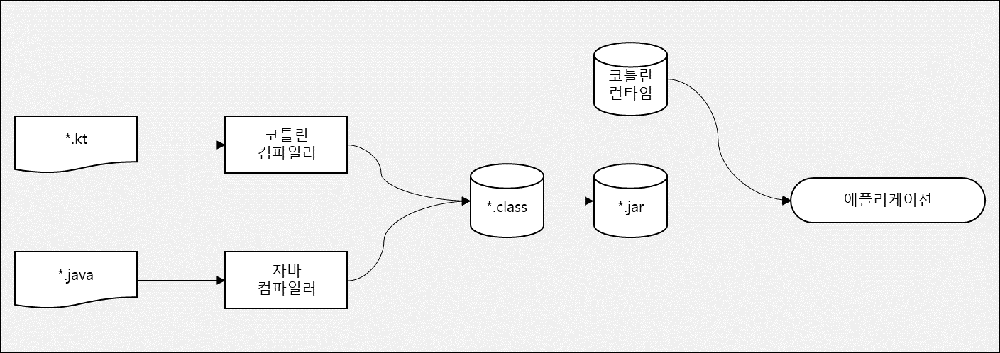

## 코틀린 도구 사용
자바와 마찬가지로 코틀린도 컴파일 언어이다. 따라서 코틀린 코드를 실행하기 전에 반드시 컴파일을 수행해야한다.
컴파일 과정은 자바와 거의 유사하다.

### 코틀린 코드 컴파일
코틀린 소스코드는 보통 .kt 확장자로 저장된다. 코틀린 컴파일러는 자바 컴파일러와 마찬가지로 코틀린 소스코드를 분석해서 .class 파일을 생성한다.
만들어진 .class 파일은 개발중인 애플리케이션의 유형에 맞는 표준 패키징 과정을 거쳐 실행될 수 있다.

```shell
kotlinc <소스파일 또는 디렉토리> -include-runtine -d <jar 이름>
java -jar <jar 이름>
```



위의 그림과 같이 코틀린 컴파일러로 컴파일한 코드는 코틀린 런타임 라이브러리에 의존한다.
런타임 라이브러리에는 코틀린 자체 표준 라이브러리 클래스와 코틀린에서 자바 API의 기능을 확장한 내용들이 들어있다.

코틀린으로 컴파일한 애플리케이션을 배포할 때는 **런타임 라이브러리도 함께 배포** 해야한다.
